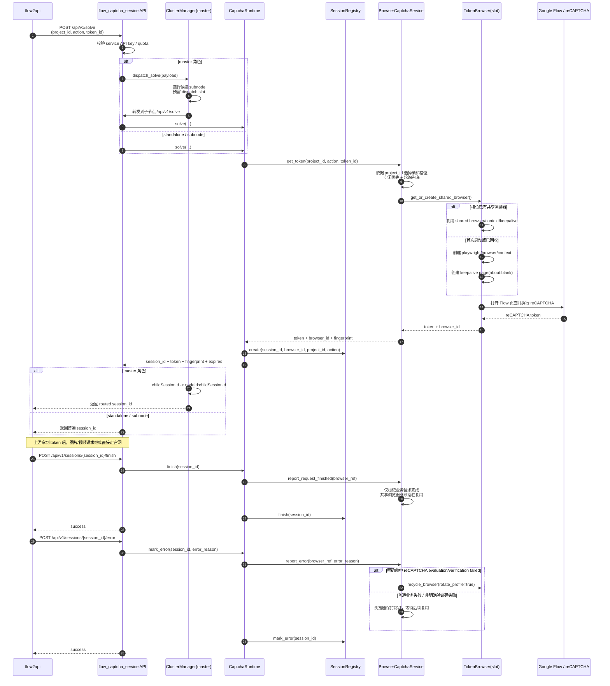
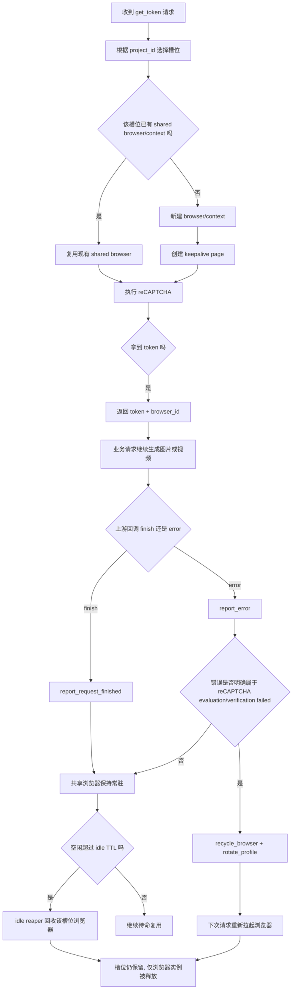
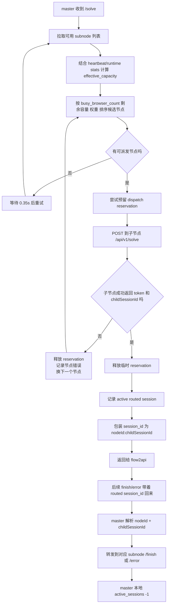
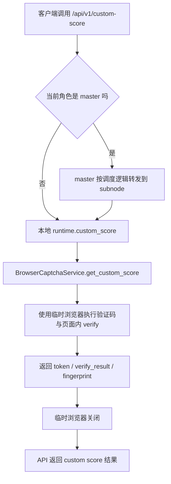

# flow_captcha_service

`flow_captcha_service` 是给 `flow2api` 使用的独立打码服务，采用 HTTP 透传方式调用。

它的核心定位不是“接第三方打码平台”，而是“自己托管有头浏览器打码能力”，并支持主从集群。

---

## 项目介绍与能力范围

### 1. 能力范围

- 仅支持有头浏览器打码（Playwright + Chromium）
- 不接 yescaptcha/capsolver 等外部平台
- 支持会话化流程：`solve -> finish/error`
- 支持 `standalone / master / subnode` 三种角色
- 支持独立用户门户（`/`）做接入说明、在线调试、自助日志查询
- 支持管理面板（`/admin`）做常用运维操作
- 支持 API Key、额度、日志、集群节点状态管理

### 2. 角色说明

- `standalone`：单机直接打码
- `master`：只调度子节点，不执行本地浏览器打码
- `subnode`：执行本地浏览器打码，并向 master 注册/心跳

---

## 项目架构

### 1. 逻辑架构

```text
flow2api
   |
   | HTTP
   v
[master]  (调度，不打码)
   |
   | 路由转发（nodeId:childSessionId）
   v
[subnode] (有头浏览器打码)
```

### 2. 关闭链路（主节点如何通知子节点关闭）

本项目没有单独 `/close` 业务接口，关闭语义通过会话协议完成：

1. 上游先调用 `solve`，master 返回 `nodeId:childSessionId`
2. 业务成功后调用 `finish`
3. master 按路由 session 转发到对应 subnode
4. subnode 执行本地 `runtime.finish()`，标记业务会话结束，浏览器通常保持常驻复用
5. 业务失败则调用 `error`，仅在明确验证码评估失败时回收对应浏览器槽位

---

## 详细流程图

### 1. `solve -> finish/error` 主链路时序图



**这张图对应的真实语义：**

- `solve` 只负责拿到 reCAPTCHA token，并把 `session_id -> browser_id` 关系登记到 `SessionRegistry`
- `finish` / `error` 是业务会话的回收协议，不是“浏览器一定关闭”的意思
- 对于常规 `solve` 主路径，浏览器是 **常驻复用** 的；成功后不会主动关闭共享浏览器
- 只有明确命中 `reCAPTCHA evaluation failed / verification failed` 这类错误时，才会回收该槽位浏览器

### 2. 浏览器槽位复用与回收流程图



**关键点：**

- 槽位数量由 `captcha.browser_count` 决定；一个槽位同一时刻只跑一个 solve
- `finish` 不会关闭共享浏览器，只是让该次业务会话结束
- `idle TTL` 是自动回收空闲浏览器，不是回收槽位；下次有请求会重新拉起浏览器
- 如果代理配置变化、浏览器断连、keepalive page 损坏，也会触发槽位级浏览器重建

### 3. master 调度与 routed session 流程图



**这张图对应的真实语义：**

- master 本身不执行本地有头浏览器打码，只做调度、转发、会话路由
- `nodeId:childSessionId` 是主节点路由会话格式，保证 `finish/error` 能准确回到原子节点
- master 额外维护了短时 `dispatch reservation`，用于覆盖 heartbeat 上报延迟，避免瞬时超发
- 节点容量依据 **busy browser slots** 统计，而不是简单把 `pending session` 当成活跃线程

### 4. `custom-score` 链路流程图



**注意：**

- `custom-score` 当前不是常驻共享浏览器链路，而是 **临时浏览器链路**
- 也就是说，主业务 `solve` 和 `custom-score` 的浏览器生命周期策略并不完全相同

### 5. 关键实现原则

1. **浏览器常驻复用，不等于业务会话常驻占槽**
   - `solve` 期间槽位忙
   - token 一旦拿到，槽位的 solve 忙碌态就会释放
   - 后续图片/视频生成继续跑，但不会把该槽位一直算成 `thread_active`

2. **`pending_sessions` 与 `busy_browser_count` 不是同一个概念**
   - `pending_sessions`：还没收到 `finish/error` 的业务会话数
   - `busy_browser_count`：当前真正正在执行 solve 的浏览器槽位数
   - 调度基于后者，避免“线程看起来一直满”的错觉

3. **同一个 `project_id` 会优先复用历史槽位**
   - 如果亲和槽位空闲，优先命中原槽位
   - 如果亲和槽位忙，才扩展到其他空闲槽位
   - 没有空闲槽位时，再走轮询兜底

4. **成功不关浏览器，明确验证码失败才回收浏览器**
   - `finish`：保留共享浏览器
   - `error`：只有在错误文本明确命中 `reCAPTCHA evaluation failed` / `verification failed` 等条件时，才回收浏览器并切换指纹
   - 普通上游业务失败不会把浏览器全部打掉

5. **空闲自动回收是为了控资源，不是为了打断复用**
   - 后台 `idle reaper` 每 15 秒巡检一次
   - 槽位空闲超过 `browser_idle_ttl_seconds` 时，回收该槽位浏览器实例
   - 新请求进来后，会按同样的槽位选择逻辑重新拉起浏览器

6. **两层句柄不要混淆**
   - 子节点本地：`browser_ref = browser_id[:request_ref]`
   - master 对外：`session_id = nodeId:childSessionId`
   - 前者用于浏览器槽位回调，后者用于跨节点会话路由


---

## 配置文件与修改方式

### 1. 配置文件位置

- 模板：`config/setting_example.toml`
- Persisted runtime config: `data/setting.toml`
- Migration: if legacy `config/setting.toml` exists, it is copied to `data/setting.toml` on startup

首次使用：

```bash
cp config/setting_example.toml data/setting.toml
```

### 2. 修改配置的两种方式

#### A. 通过管理面板（推荐）

- 入口：`http://<host>:<port>/admin`
- 可在线修改运行配置与系统配置
- 会提示哪些改动需要重启服务

#### B. Edit `data/setting.toml` directly

- 修改后重启服务生效（部分配置可热生效，但建议按重启策略执行）

### 3. 配置优先级

环境变量优先级高于 `setting.toml`。  
如果某项被环境变量覆盖，面板会显示提示。

---

## 本地部署

默认端口为 `8060`。

### 1. standalone（本地单机）

```bash
python -m venv .venv
# Windows
.venv\Scripts\activate
# Linux/Mac
source .venv/bin/activate

pip install -r requirements.txt
python main.py
```

访问：

- 用户门户：`http://127.0.0.1:8060/`
- 服务健康检查：`http://127.0.0.1:8060/api/v1/health`
- 管理面板：`http://127.0.0.1:8060/admin`

### 2. 本地主从（不走 Docker）

- 启动 master：`FCS_CLUSTER_ROLE=master`
- 启动 subnode：`FCS_CLUSTER_ROLE=subnode` 并配置：
  - `FCS_CLUSTER_MASTER_BASE_URL`
  - `FCS_CLUSTER_MASTER_CLUSTER_KEY`
  - `FCS_CLUSTER_NODE_PUBLIC_BASE_URL`
  - `FCS_CLUSTER_NODE_API_KEY`

---

## Docker 部署（含持久化）

> 推荐始终保留持久化挂载，否则重启后会丢失数据库、API Key、cluster key、日志等状态。

### 1. 持久化目录建议

- `./data`：数据库与运行状态（必须持久化）
- `./config`：配置文件（建议持久化）

### 2. standalone（有头）

```bash
docker compose -f docker-compose.headed.yml up -d --build
```

默认已挂载：

- `./data:/app/data`
- `./config:/app/config`

### 3. master（轻量镜像）

```bash
docker compose -f docker-compose.cluster.master.yml up -d --build
```

使用 `Dockerfile.master`（不安装 Playwright/Chromium，镜像更小）。

### 4. subnode（有头镜像）

```bash
docker compose -f docker-compose.cluster.subnode.yml up -d --build
```

启动前要替换：

- `FCS_CLUSTER_MASTER_CLUSTER_KEY`
- `FCS_CLUSTER_NODE_API_KEY`

---

## 一键部署（master + subnode）

```bash
docker compose -f docker-compose.cluster.stack.yml up -d --build
```

该方案同时拉起：

- `flow-captcha-master`（轻量镜像）
- `flow-captcha-subnode`（有头镜像）

默认持久化路径：

- `./data/master:/app/data`
- `./data/subnode:/app/data`
- `./config:/app/config`

启动前至少替换：

- `FCS_CLUSTER_MASTER_CLUSTER_KEY`
- `FCS_CLUSTER_NODE_API_KEY`

---

## GHCR 镜像

项目通过 GitHub Actions 自动发布到 GHCR：

- `ghcr.io/<owner>/flow_captcha_service-master`（轻量 master）
- `ghcr.io/<owner>/flow_captcha_service-headed`（有头 standalone/subnode）
- 发布架构：`linux/amd64`、`linux/arm64`

拉取示例：

```bash
docker pull ghcr.io/genz27/flow_captcha_service-master:latest
docker pull ghcr.io/genz27/flow_captcha_service-headed:latest
```

### 拉取镜像是否需要环境变量？

- `docker pull`：不需要环境变量
- `docker run / docker compose up`：需要按角色配置环境变量

如果仓库/包是私有，请先使用带 `read:packages` 权限的 PAT 登录 GHCR。

---

## 常见问题

### `exec /usr/local/bin/entrypoint.headed.sh: exec format error`

排查顺序：

1. 确认机器架构（你是 `x86_64/amd64`）
2. 确认拉到的是新镜像（重新 `docker pull`）
3. 删除旧 tag 本地缓存后再拉取并重启容器

本仓库已将有头镜像启动方式改为内联 `bash` 启动流程，不再依赖脚本文件执行，可避免该错误。


- `cluster.node_max_concurrency = 0` means the dispatcher follows `captcha.browser_count`.
